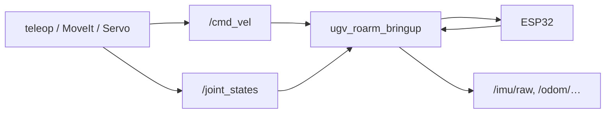

# Hardware Driver

**`ugv_roarm_bringup`** is the ROS2 bridge to the ESP32 base board for **both** the mobile base and the RoArm. It replaces separate `ugv_bringup` + `roarm_driver` when using the combined kit.

---

## Node: `ugv_roarm_bringup`

| Direction | Topic / interface | Notes |
|-----------|-------------------|-------|
| Subscribe | `/cmd_vel` | Differential drive commands |
| Subscribe | `/joint_states` | Arm joint targets → forwarded to ESP32 |
| Subscribe | `/ugv/led_ctrl` | LED patterns |
| Publish | `/imu/raw`, `/imu/mag` | IMU data |
| Publish | `/odom/odom_raw` | Wheel odometry (raw) |
| Publish | `/ugv/voltage` | Battery |

**Serial:** default **`/dev/ttyAMA0`**, baud **115200** (Pi UART to ESP32).

Parameters:

```bash
ros2 run ugv_roarm_bringup ugv_roarm_bringup --ros-args \
  -p serial_port:=/dev/ttyAMA0
```

Reads **`ROARM_MODEL`** from the environment for arm-specific command formatting.

---

## Launch: `bringup_lidar.launch.py`

Main entry point for the real robot:

```bash
ros2 launch ugv_roarm_bringup bringup_lidar.launch.py use_rviz:=true rviz_config:=bringup
```

!!! note "Name vs what it starts"
    The file is still named **`bringup_lidar`**, but the **current launch does not start LiDAR, rf2o, or EKF** (those includes are commented out in the launch file). For `/scan` and full localization stacks, use [ugv_ws](https://github.com/waveshareteam/ugv_ws) bringup / SLAM / Nav launches (or re-enable those lines if you customize the launch).

### RViz Fixed Frame (real hardware) {#rviz-bringup-fixed-frame}

On the **real robot**, `rviz_config:=bringup` loads **`view_bringup.rviz`**, which sets **Fixed Frame** to **`odom`**.

With the **current** defaults, **`odom` is usually not in TF yet**: EKF is not started, and **`pub_odom_tf`** defaults to **`false`**, so `odom_publisher` does not publish `odom` → `base_footprint`. RViz may report *Fixed Frame [odom] does not exist* or show a blank view.

**Workaround:** In RViz **Global Options → Fixed Frame**, choose **`base_footprint`** or **`base_link`**. The combined model appears from **`robot_state_publisher`** immediately. If you need the odometry frame, set **`pub_odom_tf:=true`** (wheel TF only — still no EKF fusion) and switch Fixed Frame back to **`odom`** once TF is publishing.

**Simulation** ([Gazebo](gazebo.md)) publishes **`odom`** from the simulator — this workaround is **not** needed there.

### What this launch starts

1. **`ugv_roarm_description/display.launch.py`** — `robot_state_publisher` + optional RViz + `ros2_control` + **`setgrippercmd`** (unless `use_moveit_servo:=true`)
2. **`ugv_roarm_bringup`** node
3. **`ugv_bringup/odom_publisher`** — when `use_ekf:=true` (default): consumes **`/odom/odom_raw`**; does **not** start `ekf_filter_node`

**Not started** (commented out in launch): `ldlidar`, `rf2o_laser_odometry`, `ekf_filter_node`.

Launch arguments:

| Argument | Default | Purpose |
|----------|---------|---------|
| `use_rviz` | `false` | Open RViz |
| `rviz_config` | `bringup` | Preset key — with default `display` path: `description`, `bringup`, `slam_*`, `nav_*`. For MoveIt UIs use `use_moveit_servo:=true` and e.g. `moveit` / `moveit_servo` / `moveit_mtc` |
| `use_ekf` | `true` | Start **`odom_publisher` only** (name is historical — EKF node is not launched) |
| `pub_odom_tf` | `false` | If `true`, `odom_publisher` publishes `odom` → `base_footprint` TF |
| `use_moveit_servo` | `false` | Include MoveIt Servo stack instead of plain `display` |
| `add_camera` | `false` | Include USB camera links in URDF — set **`true`** for [Vision pick-place](vision.md) (**`camera_link`** TF) |
| `add_depth_camera` | `false` | Forwarded to description / Servo URDF (product-dependent) |

---

## Data transfer process



MoveIt / Servo publish arm trajectories through **`ros2_control`** → **`/joint_states`** → driver.

---

## Prerequisites

- **`UGV_MODEL=ugv_rover`**, **`ROARM_MODEL=roarm_m2`**, **`GRIPPER_TYPE=angular_direct`**
- Robot powered; UART connected
- No other node using `/dev/ttyAMA0`

---

## Troubleshooting

| Problem | What to try |
|---------|-------------|
| RViz empty / *Fixed Frame [odom] does not exist* | Set **Fixed Frame** → **`base_footprint`** or **`base_link`**, or use **`pub_odom_tf:=true`** — see [RViz Fixed Frame](#rviz-bringup-fixed-frame) |
| No `/scan` / no LiDAR in this launch | Expected — LiDAR is not started here; use ugv_ws lidar/bringup (or enable the commented lidar include) |
| No serial / no `/odom/odom_raw` | Power robot; check **`/dev/ttyAMA0`**; only one driver node |

---

## Next

- [UGV Teleoperation](teleoperation.md) — drive the base with adjustable speed (`keyboard_ctrl` / gamepad)
- [MoveIt2](moveit2.md) — arm planning on real hardware or simulation
- [MoveIt Servo](moveit_servo.md) — real-time arm jog
