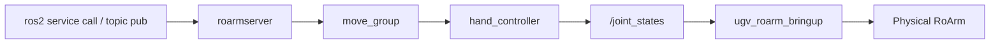

# Command Control (optional)

!!! note "Optional / advanced"
    Skip this chapter for normal use. Bringup, teleop, [MoveIt2](moveit2.md), [MoveIt Servo](moveit_servo.md), and [Vision](vision.md) pick-place do **not** need Command Control.

    Use this page for CLI motion services (`/move_joint_cmd`, …). Full API: [roarm_ws command_control](https://github.com/waveshareteam/roarm_ws/blob/ros2-humble-develop-251125/docs/command_control.md).

Move the arm with **ROS2 services** (`/get_pose_cmd`, `/move_joint_cmd`, …) and the **`/gripper_cmd`** topic — suited to scripts and repeatable goals. Keep **`ugv_roarm_bringup`** running; close other MoveIt / Servo / MTC launches before starting this stack.

For MoveIt basics, see [MoveIt2](moveit2.md).  
For frames and `hand_tcp`, see [RoArm Basics](roarm_basics.md).  
For the serial driver, see [Hardware Driver](bringup.md).

---

## Prerequisites

Before launching MoveIt Cmd:

1. **Build and source** **`ugv_roarm_ws`** ([Installation](installation.md)).
2. Set **`UGV_MODEL=ugv_rover`**, **`ROARM_MODEL=roarm_m2`**, **`GRIPPER_TYPE=angular_direct`** — see [index — environment variables](index.md#product-names-vs-environment-variables).
3. Robot powered; UART on **`/dev/ttyAMA0`**; no other node using the port.
4. **Close any other arm / MoveIt launch** — integrated MoveIt/Servo bringup ([MoveIt2](moveit2.md)), [MTC Demo](mtc_demo.md), or **`display.launch.py`**. Press **`Ctrl+C`** in those terminals.
5. [**Start the driver**](bringup.md#node-ugv_roarm_bringup) in **Terminal 0** and leave it running (see **Real hardware — two terminals** below).

Requires **`roarm_moveit_cmd`** and **`roarm_msgs`** from [roarm_ws](https://github.com/waveshareteam/roarm_ws) (factory image or sibling workspace).

!!! warning "Safety"
    With **`ugv_roarm_bringup` running**, the real arm moves when you launch Cmd (**`initial_positions.yaml`**), when a motion service succeeds, and when you publish **`/gripper_cmd`**. Clear the area around the arm and keep the **chassis stationary** during arm motion.

---

## MoveIt2 vs Servo vs Command Control

All three use the same URDF, **`ugv_roarm_bringup`**, and **`/joint_states`** on hardware. Run **one stack at a time**.

| | **MoveIt2** ([MoveIt2](moveit2.md)) | **Servo** ([MoveIt Servo](moveit_servo.md)) | **Command Control** (this page) |
|---|-----|-----|-----|
| **Launch** | `bringup_lidar use_moveit_servo:=true` (integrated) | Same integrated bringup + `keyboardcontrol` | **T0** driver **+** `command_control.launch.py` |
| **Purpose** | Drag **`hand_tcp`** — Plan & Execute | **Teleop** — jog while keys / sticks held | **Discrete goals** — pose / path from services |
| **Input** | RViz interactive marker | Keyboard / gamepad | `ros2 service call …`, **`/gripper_cmd`** |
| **Planning** | **`move_group`** plan & execute | `servo_node` (incremental IK) | `roarmserver` → solver IK → **`move_group`** |
| **Moves real arm?** | On **Execute** in RViz | While jogging | **Immediately** when service succeeds |

For optional multi-stage task demos, see [MTC Demo](mtc_demo.md).

**Data path (Cmd on hardware):** service request → **`roarmserver`** → **`move_group`** → `hand_controller` → **`/joint_states`** → **`ugv_roarm_bringup`** → ESP32.

---

## Real hardware — two terminals

On hardware, Cmd uses **two terminals**: the **driver** plus **`command_control.launch.py`**. Service calls can run from T1 or any other sourced terminal.

| Terminal | Command | Keep open? |
|----------|---------|------------|
| **T0** | `ugv_roarm_bringup` (driver only) | Yes — entire session |
| **T1** | `roarm_moveit_cmd command_control.launch.py` | Yes — while using services |

!!! note "Why not `bringup_lidar` for T0?"
    Default **`bringup_lidar.launch.py`** includes **`display.launch.py`**, which starts its own **`ros2_control`**. T1 **`command_control.launch.py`** also starts **`ros2_control`** — running both causes controller conflicts. For Cmd, start **only the driver** in T0 (same idea as **`roarm_driver`** in [roarm_ws command_control](https://github.com/waveshareteam/roarm_ws/blob/ros2-humble-develop-251125/docs/command_control.md)).

### Terminal 0 — driver

```bash
ros2 run ugv_roarm_bringup ugv_roarm_bringup --ros-args -p serial_port:=/dev/ttyAMA0
```

### Terminal 1 — MoveIt Cmd

```bash
ros2 launch roarm_moveit_cmd command_control.launch.py use_rviz:=true
```

Right after launch, the arm often **moves to `initial_positions.yaml`** on its own. **`ugv_roarm_bringup` forwards that to the motors** — expect this motion; do not block the arm.

---

## Real hardware data flow

### Launch nodes

| Node / process | Role | Started by |
|----------------|------|------------|
| `ugv_roarm_bringup` | Serial bridge — `/joint_states` → ESP32 | T0 |
| `robot_state_publisher` | URDF + `/joint_states` → TF | T1 |
| `move_group` | Plans and executes trajectories for service requests | T1 |
| `ros2_control_node` + controllers | `hand_controller`, `gripper_controller`, `joint_state_broadcaster` | T1 |
| `roarmserver` | `/get_pose_cmd`, `/move_joint_cmd`, `/move_line_cmd`, `/move_circle_cmd` | T1 |
| `setgrippercmd` | Bridges **`/gripper_cmd`** → gripper controller | T1 |
| `rviz2` | **`command_control.rviz`** (when `use_rviz:=true`) | T1 |

### Data transfer



On real hardware, `ros2_control` uses **`mock_components/GenericSystem`** — it does not talk to serial directly. Trajectories update **`/joint_states`**, and **`ugv_roarm_bringup`** forwards them to the ESP32.

Poses use solver **real TCP** in **`base_link`** — [RoArm Basics](roarm_basics.md). Full service syntax and examples: [roarm_ws command_control](https://github.com/waveshareteam/roarm_ws/blob/ros2-humble-develop-251125/docs/command_control.md).

---

## Common services

| Service | Purpose |
|---------|---------|
| `/get_pose_cmd` | Read current TCP pose |
| `/move_joint_cmd` | Move to pose (x/y/z + gripper; M3 adds roll/pitch/yaw) |
| `/move_line_cmd` | Linear move |
| `/move_circle_cmd` | Arc through waypoint |
| `/pick_place_cmd` | Pick or place from perception TF (requires **`roarm_vision`** — see [Vision](vision.md)) |

Example — read pose:

```bash
ros2 service call /get_pose_cmd roarm_msgs/srv/GetPoseCmd
```

---

## Troubleshooting

| Problem | What to try |
|---------|-------------|
| Duplicate `ros2_control` / controller errors | T0 must be **driver only** — do not use default **`bringup_lidar`** with T1 Cmd |
| Service exists but arm does not move | Is **`ugv_roarm_bringup`** running in T0? Check `/dev/ttyAMA0` |
| `Package 'roarm_moveit_cmd' not found` | Source [roarm_ws](https://github.com/waveshareteam/roarm_ws) or use factory image |
| Arm moves on T1 launch | **`initial_positions.yaml`** — normal; keep clearance |
| Chassis moved during arm motion | Keep base stationary; Cmd only commands arm joints via **`/joint_states`** |

---

## `ugv_roarm_cmd` (advanced)

**`navigatetoposecmd`** combines Nav2 base navigation with pick/place — requires **`ugv_nav`**, **`roarm_vision`**, and a saved map. Not covered here; see [ugv_ws navigation](https://github.com/waveshareteam/ugv_ws/blob/ros2-humble-develop-251125/docs/navigation.md) when you extend to full mobile manipulation.

---

## Next

- [Vision](vision.md) — camera, color track, pick-place
- [MTC Demo](mtc_demo.md) — *(optional)* task-constructor demos
- [MoveIt2](moveit2.md) — Plan & Execute in RViz

When switching tutorials, stop the current launch with **`Ctrl+C`**. Keep **`ugv_roarm_bringup`** in T0 only if the next chapter reuses the same driver terminal.
