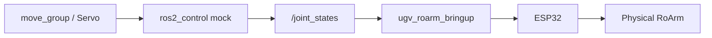

# MoveIt2

**`ugv_roarm_moveit`** configures MoveIt2 for **RoArm-M2** on the UGV Rover. Planning group **`hand`**, end-effector frame **`hand_tcp`**. Configuration: `config/roarm_m2/` (requires **`ROARM_MODEL=roarm_m2`**).

IKFast plugins: **`ugv_roarm_moveit_ikfast_plugins`**.

For the combined URDF, see [Robot Description](description.md).  
For `hand_tcp` vs real TCP, see [RoArm Basics](roarm_basics.md).  
For the serial driver, see [Hardware Driver](bringup.md).

---

## Prerequisites

1. **Build and source** **`ugv_roarm_ws`** ([Installation](installation.md)).
2. Set **`UGV_MODEL=ugv_rover`**, **`ROARM_MODEL=roarm_m2`**, **`GRIPPER_TYPE=angular_direct`** — see [index — environment variables](index.md#product-names-vs-environment-variables).
3. Robot powered; UART on **`/dev/ttyAMA0`**; no other node using the port.

!!! warning "Safety"
    With **`ugv_roarm_bringup` running**, the real arm can move when MoveIt starts or when you **Plan & Execute**. Clear the area around the arm before launching.

---

## How `bringup_lidar` and MoveIt fit together

`bringup_lidar.launch.py` always starts **`ugv_roarm_bringup`** (serial driver) and **`odom_publisher`**.

What changes is the **`use_moveit_servo`** argument:

| `use_moveit_servo` | Robot model / control stack | MoveIt |
|--------------------|----------------------------|--------|
| **`false`** (default) | Includes **`display.launch.py`** → `robot_state_publisher` + `ros2_control` | No `move_group` |
| **`true`** | Includes **`servo_control.launch.py`** instead of `display.launch.py` | Full **`ugv_roarm_moveit.launch.py`** (`move_group` + `ros2_control` + RViz) + MoveIt Servo |

When **`use_moveit_servo:=true`**, bringup does **not** start `display.launch.py`, so there is only **one** `ros2_control` stack — the one inside the included MoveIt launch. The driver still runs in the same `bringup_lidar` process.

**Data transfer process**



---

## Real hardware — one launch (recommended)

Start the driver, MoveIt (`move_group` + `ros2_control`), and RViz in **one command**:

```bash
ros2 launch ugv_roarm_bringup bringup_lidar.launch.py \
  use_rviz:=true \
  use_moveit_servo:=true \
  rviz_config:=moveit_servo
```

This opens **`servo_control.rviz`** (MoveIt planning scene + Servo). For keyboard jogging, add **T1:** `ros2 run ugv_roarm_moveit_servo keyboardcontrol` — see [MoveIt Servo](moveit_servo.md).

---

## Plan & Execute in RViz (drag `hand_tcp`)

Same integrated bringup (driver + `move_group` + `ros2_control`), but set **`rviz_config:=moveit`** so RViz loads **`interact.rviz`** (Motion Planning). Without `rviz_config`, bringup defaults to **`bringup`** → **`view_bringup.rviz`**, which is not a Plan & Execute UI.

```bash
ros2 launch ugv_roarm_bringup bringup_lidar.launch.py \
  use_rviz:=true \
  use_moveit_servo:=true \
  rviz_config:=moveit
```

For Servo jogging UI instead, use **`rviz_config:=moveit_servo`** → **`servo_control.rviz`** (see [recommended](#real-hardware--one-launch-recommended) above and [MoveIt Servo](moveit_servo.md)).

In RViz **Motion Planning**:

1. Drag the **`hand_tcp`** interactive marker
2. **Plan** → **Execute**

Trajectories go through **`ros2_control`** → **`/joint_states`** → **`ugv_roarm_bringup`**.

Right after launch, the arm may move toward **`initial_positions.yaml`** — keep clearance around the arm.

### Launch nodes

| Node / process | Role |
|----------------|------|
| `ugv_roarm_bringup` | Serial bridge — forwards `/joint_states` to ESP32 |
| `robot_state_publisher` | Publishes TF from URDF |
| `move_group` | Motion planning, IK, trajectory execution |
| `ros2_control_node` + controllers | `hand_controller` / `gripper_controller` → `/joint_states` |
| `servo_node` + gamepad helpers | MoveIt Servo (keyboard/gamepad) — also started by this integrated path |
| `rviz2` | **`interact.rviz`** when `rviz_config:=moveit` |

---

## Launch arguments (`ugv_roarm_moveit.launch.py`)

| Argument | Default | Purpose |
|----------|---------|---------|
| `use_rviz` | `false` | Open RViz |
| `rviz_config` | `moveit` | Use `moveit` for Plan & Execute UI (`interact.rviz`) |

Bringup-side arguments (`bringup_lidar.launch.py`):

| Argument | Default | Purpose |
|----------|---------|---------|
| `use_moveit_servo` | `false` | If `true`, include MoveIt + Servo instead of `display.launch.py` |
| `use_rviz` | `false` | Open RViz (preset from `rviz_config` or servo stack) |
| `rviz_config` | `bringup` | Default path → `view_bringup.rviz`. With `use_moveit_servo:=true`, use `moveit` (`interact.rviz`) or `moveit_servo` (`servo_control.rviz`) |
| `add_camera` | `false` | USB camera links in URDF |
| `pub_odom_tf` | `false` | `odom` → `base_footprint` from `odom_publisher` |
| `use_ekf` | `true` | Starts **`odom_publisher` only** (EKF not launched in current bringup) |

---

## Frames

Planning uses **`hand_tcp`** relative to **`ugv_roarm_base_link`** (arm root on the chassis — not UGV **`base_link`**). See [RoArm Basics](roarm_basics.md) for `hand_tcp` vs real TCP.

When the UGV drives, the arm TF subtree moves with chassis **`base_link`** in **`odom`** — keep the base stationary during arm execution.

---

## Troubleshooting

| Problem | What to try |
|---------|-------------|
| Arm does not move on Execute | Confirm **`ugv_roarm_bringup`** is running (from bringup **T0** or integrated launch); check `/dev/ttyAMA0` |
| Duplicate `ros2_control` / controller errors | Do not mix default bringup (`use_moveit_servo:=false`) with a second full **`ugv_roarm_moveit`** launch — use **`use_moveit_servo:=true`** integrated launch, or stop bringup before starting MoveIt |
| No robot in RViz | **Fixed Frame** → `base_footprint`, `base_link`, or `ugv_roarm_base_link`; add **MotionPlanning** display for Plan & Execute |
| `KeyError: 'ROARM_MODEL'` / `'GRIPPER_TYPE'` | `source ~/.bashrc`; expected `roarm_m2` and `angular_direct` |

---

## Next

- [MoveIt Servo](moveit_servo.md) — Servo jogging (often same integrated bringup command)
- [Command Control](command_control.md) — *(optional)* CLI motion services
- [MTC Demo](mtc_demo.md) — *(optional)* multi-stage task demos

When switching tutorials, stop the current launch with **`Ctrl+C`**. Keep **`ugv_roarm_bringup`** running only if the next chapter uses the same bringup terminal.
