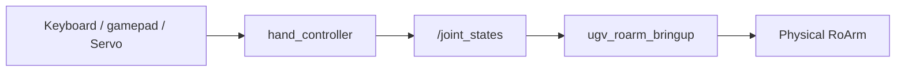

# MoveIt Servo

**`ugv_roarm_moveit_servo`** — real-time **arm** jogging (Cartesian / joint) via keyboard or gamepad. Optional **fixed-speed** chassis via D-Pad or arrow keys.

Chassis-only drive with **adjustable speed** (gears / limits): [UGV Teleoperation](teleoperation.md).

For the serial driver and bringup flags, see [Hardware Driver](bringup.md).  
For Plan & Execute (drag marker), see [MoveIt2](moveit2.md).

---

## Prerequisites

1. **Build and source** **`ugv_roarm_ws`** ([Installation](installation.md)).
2. Set **`UGV_MODEL=ugv_rover`**, **`ROARM_MODEL=roarm_m2`**, **`GRIPPER_TYPE=angular_direct`** — see [index — environment variables](index.md#product-names-vs-environment-variables).
3. **Stop other arm launches** — for example `display.launch.py`, a separate **`ugv_roarm_moveit.launch.py`**, or MTC. Press **`Ctrl+C`** in those terminals.

!!! warning "Safety"
    With **`ugv_roarm_bringup` running**, the real arm moves as soon as Servo starts and while you jog (keyboard, gamepad, or arrow keys). Clear the area around the arm and chassis before launching.

---

## MoveIt2 vs MoveIt Servo

| | **MoveIt2** ([moveit2.md](moveit2.md)) | **MoveIt Servo** (this page) |
|---|---|---|
| **Launch** | `ugv_roarm_moveit.launch.py` or bringup with `use_moveit_servo:=true` | Same integrated bringup, or `servo_control.launch.py` |
| **Purpose** | Plan a path to a **target pose** | **Jog** the arm in real time |
| **Input** | Drag **`hand_tcp`** → **Plan & Execute** | Keyboard (`keyboardcontrol`) or gamepad (`joy_node`) |
| **RViz** | `interact.rviz` — MotionPlanning | `servo_control.rviz` |
| **Real arm** | After **Plan & Execute** | **Immediately** while jogging |

**Data transfer process**



---

## Launch — real hardware (recommended)

Use **`bringup_lidar.launch.py`** with **`use_moveit_servo:=true`**. This starts:

- **`ugv_roarm_bringup`** — serial driver (always from bringup)
- **`servo_control.launch.py`** — includes **`ugv_roarm_moveit.launch.py`** (`move_group` + `ros2_control`) + Servo + **`joy_node`**
- Does **not** include plain **`display.launch.py`** — avoids duplicate `ros2_control`

**T0** — one launch:

```bash
ros2 launch ugv_roarm_bringup bringup_lidar.launch.py \
  use_rviz:=true \
  use_moveit_servo:=true \
  rviz_config:=moveit_servo
```

**T1** — keyboard only (if not using gamepad):

```bash
ros2 run ugv_roarm_moveit_servo keyboardcontrol
```

Gamepad: connect after **T0** — **`joy_node`** and **`JoyToServoPub`** already start with the integrated launch. Turn the gamepad off when switching to keyboard to avoid conflicts.

With Gazebo, add **`use_sim_time:=true`** on the Servo / MoveIt launch (or bringup path that includes it).

### Launch nodes

| Node / process | Role |
|----------------|------|
| `ugv_roarm_bringup` | Serial bridge — `/joint_states` → ESP32 |
| `robot_state_publisher` | URDF + TF |
| `move_group` | Planning scene monitor |
| `ros2_control_node` + controllers | `hand_controller`, `gripper_controller` → `/joint_states` |
| `servo_node` | Real-time IK; streams to `hand_controller` |
| `controller_to_servo_node` | Gamepad **`/joy`** → Servo |
| `joy_node` | Gamepad driver |
| `setgrippercmd` | **`/gripper_cmd`** bridge |
| `rviz2` | **`servo_control.rviz`** (`use_rviz:=true`) |

---

## Cartesian jog frames

In twist mode (**`t`** on keyboard, or hold **R1** on gamepad), jog axes follow the **current planning frame**:

| Switch | Planning frame | Notes |
|--------|----------------|-------|
| **`w`** / gamepad **X** | **`ugv_roarm_base_link`** | Arm mount on the chassis (not UGV `base_link`) |
| **`e`** / gamepad **Y** | **`hand_tcp`** | Tool frame — axes move with the gripper |

See [RoArm Basics](roarm_basics.md) for axis conventions.

**Joint jog** (**`j`** / release **R1**): keys **`1`**–**`3`** on RoArm-M2 (`base_link_to_link1`, `link1_to_link2`, `link2_to_link3`).

---

## Gamepad control

Use an **Xbox 360–compatible** USB controller or **SHANWAN Android Gamepad** (same as [roarm_ws keyboard_control](https://github.com/waveshareteam/roarm_ws/blob/ros2-humble-develop-251125/docs/keyboard_control.md) / [ugv_ws teleoperation](https://github.com/waveshareteam/ugv_ws/blob/ros2-humble-develop-251125/docs/teleoperation.md)).

After the integrated bringup is running, connect the controller — no extra launch command. On the first **`/joy`** message, stick positions are zeroed; release sticks before jogging.

**Click an image for full-screen view** — click outside, press **Esc**, or **×** to close.


### Mode switch

| Control | Mode |
|---------|------|
| **R1** held | Cartesian twist |
| **R1** released | Joint jog |

### Frame switch (twist mode)

| Button | Action |
|--------|--------|
| **X** | Planning frame → **`ugv_roarm_base_link`** |
| **Y** | Planning frame → **`hand_tcp`** |

### Gripper

| Button | Action |
|--------|--------|
| **A** | Close gripper |
| **B** | Open gripper |

### RoArm-M2 — coordinate (hold **R1**)

| Control | Action |
|---------|--------|
| Left stick Y / X | ±X / ±Y |
| Left stick press | ±Z — direction set by **R2** |

### RoArm-M2 — joint (release **R1**)

| Control | Joint |
|---------|--------|
| Left stick X | Base (`base_link_to_link1`) |
| Left stick Y | Shoulder (`link1_to_link2`) |
| Left stick press | Elbow (`link2_to_link3`) — direction set by **R2** |

### Mobile base (D-Pad)

**`JoyToServoPub`** also publishes **`/cmd_vel`**. Speeds are **fixed** (not geared like [UGV Teleoperation](teleoperation.md)):

| Control | Action |
|---------|--------|
| **D-Pad** ↑ / ↓ | Forward / back (`linear.x`, scale **0.2**) |
| **D-Pad** ← / → | Rotate in place (`angular.z`, scale **0.5**; left = turn left) |

To **change chassis speed** (L1/L2 gears, `q/z`, launch limits), use **`ugv_tools`** instead — [UGV Teleoperation](teleoperation.md). Do **not** run both at once.

### Supported controllers

| Name reported at startup | Mapping |
|--------------------------|---------|
| `Xbox 360 Controller` | Xbox layout (default) |
| `SHANWAN Android Gamepad` | ShanWan layout |

Other pads use the **Xbox 360** button map. If axes feel wrong, check the name printed when the joy bridge starts.

---

## Keyboard control

**`If you no longer need gamepad control, please turn the gamepad off to avoid control conflicts.`**

**T1** terminal — keep focus here for key input:

```bash
ros2 run ugv_roarm_moveit_servo keyboardcontrol
```

Press **`Q`** to quit.

### Mode switch

| Key | Mode |
|-----|------|
| **`t`** | Cartesian **twist** (end-effector jog) |
| **`j`** | **Joint jog** |

### Frame switch (twist mode)

| Key | Action |
|-----|--------|
| **`w`** | Planning frame → **`ugv_roarm_base_link`** |
| **`e`** | Planning frame → **`hand_tcp`** |

### Gripper (RoArm-M2)

| Key | Action |
|-----|--------|
| **`g`** | Step gripper open/close |
| **`s`** | Reverse jog direction (twist, joint, gripper step) |

### RoArm-M2 — coordinate (press **`t`** first)

**Click an image for full-screen view** — click outside, press **Esc**, or **×** to close.


| Key | Action |
|-----|--------|
| **`x`** / **`y`** / **`z`** | ±X / ±Y / ±Z in current frame |

### RoArm-M2 — joint (press **`j`** first)

| Key | Joint |
|-----|--------|
| **`1`** | Base (`base_link_to_link1`) |
| **`2`** | Shoulder (`link1_to_link2`) |
| **`3`** | Elbow (`link2_to_link3`) |

### Mobile base (arrow keys)

**`keyboardcontrol`** publishes **`/cmd_vel`** at **fixed** scales (forward **0.2**, turn **0.5**). Arrow keys **latch** (same idea as [UGV Teleoperation](teleoperation.md) drive keys) — they do **not** stop when you release the key.

| Key | Action |
|-----|--------|
| **↑** / **↓** | Forward / back (latched) |
| **←** / **→** | Rotate in place (latched) |
| **`k`** / **Space** | Stop chassis — zero **`/cmd_vel`** |

For adjustable chassis speed, use [UGV Teleoperation](teleoperation.md) (`keyboard_ctrl`) — not both at once.

## Troubleshooting

| Problem | What to try |
|---------|-------------|
| Duplicate controller / node errors | Use **`use_moveit_servo:=true`** on bringup; do not stack default bringup + `servo_control` |
| Arm does not move while jogging | Confirm **`ugv_roarm_bringup`** is running (from integrated bringup); check `/dev/ttyAMA0` |
| Keyboard has no effect | Focus the **`keyboardcontrol`** terminal; confirm **T0** Servo stack is still running |
| Gamepad and keyboard both active | Use one input at a time; disconnect gamepad for keyboard |
| Base moves unexpectedly / jerky / no turn | **T0** includes **`JoyToServoPub`** — it must **not** publish zero **`/cmd_vel`** when D-Pad is idle (fixed in this package). Rebuild **`ugv_roarm_moveit_servo`**. Do not run **`ugv_tools`** teleop at the same time |
| Base does not rotate with arrow keys | Focus **`keyboardcontrol`** terminal; use **←/→** (not arm **`j/l`** keys). **`k`** / **Space** to stop |
| `KeyError: 'ROARM_MODEL'` | `source ~/.bashrc`; set `roarm_m2` and `angular_direct` |

---

## Next

- [MoveIt2](moveit2.md) — Plan & Execute in RViz
- [Command Control](command_control.md) — *(optional)* CLI motion services
- [MTC Demo](mtc_demo.md) — *(optional)* task-constructor demos

Stop the current launch with **`Ctrl+C`** before switching tutorials.
