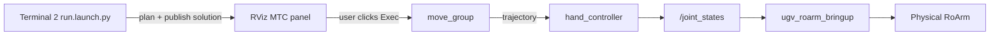

# MTC Demo (optional)

!!! note "Optional / advanced"
    Skip this chapter for normal use. Bringup, teleop, [MoveIt2](moveit2.md), [MoveIt Servo](moveit_servo.md), and [Vision](vision.md) pick-place do **not** need MTC.

Use this page only if you want MoveIt Task Constructor demos (stage trees, RViz **Exec**). Same idea as [roarm_ws mtc_demo](https://github.com/waveshareteam/roarm_ws/blob/ros2-humble-develop-251125/docs/mtc_demo.md).

**`ugv_roarm_moveit_mtc_demo`** runs [MoveIt Task Constructor](https://github.com/ros-planning/moveit_task_constructor) demos — Cartesian paths and pick/place task pipelines. You **plan** in a task executable, inspect the solution in RViz, then **execute on the real arm** after clicking **`Exec`**.

Depends on **`moveit_task_constructor`** (from roarm_ws / factory image).

For MoveIt basics, see [MoveIt2](moveit2.md).  
For frames and `hand_tcp`, see [RoArm Basics](roarm_basics.md).  
For the serial driver, see [Hardware Driver](bringup.md).

---

## Prerequisites

1. **Build and source** **`ugv_roarm_ws`** ([Installation](installation.md)).
2. Set **`UGV_MODEL=ugv_rover`**, **`ROARM_MODEL=roarm_m2`**, **`GRIPPER_TYPE=angular_direct`** — see [index — environment variables](index.md#product-names-vs-environment-variables).
3. Robot powered; UART on **`/dev/ttyAMA0`**; no other node using the port.
4. **Close any other arm / MoveIt launch** — for example integrated MoveIt/Servo bringup ([MoveIt2](moveit2.md)), [Command Control](command_control.md), or a plain **`display.launch.py`** session. Press **`Ctrl+C`** in those terminals.
5. [**Start the driver**](bringup.md#node-ugv_roarm_bringup) in **Terminal 0** and leave it running (see **Real hardware — three terminals** below).

!!! warning "Safety"
    With **`ugv_roarm_bringup` running**, the real arm can move when you launch MTC (**`initial_positions.yaml`**) and when you click **`Exec`** in RViz. Clear the area around the arm and keep the **chassis stationary** during execution. Stop with **`Ctrl+C`** when done.

---

## MoveIt2 vs Command Control vs MTC

All three stacks use the same URDF, **`ugv_roarm_bringup`**, and **`/joint_states`** path on hardware. Run **one stack at a time** — close the launches listed in [Prerequisites](#prerequisites) before MTC (and close MTC before switching to MoveIt2, Command Control, or Servo).

| | **MoveIt2** ([MoveIt2](moveit2.md)) | **Command Control** ([Command Control](command_control.md)) | **MTC** (this page) |
|---|-----|-----|-----|
| **Launch** | `bringup_lidar.launch.py use_moveit_servo:=true` (integrated) | **T0** driver **+** `command_control.launch.py` | **T0** driver **+** `demo.launch.py` **+** `run.launch.py exe:=…` |
| **Purpose** | Drag **`hand_tcp`** in RViz — Plan & Execute | **Discrete goals** — pose / path from services | **Multi-stage tasks** — chain moves, Cartesian steps, gripper, pick/place demos |
| **Input** | RViz interactive marker → **Plan** → **Execute** | `ros2 service call …` (e.g. `/move_joint_cmd`) | Task **executable** (`exe:=cartesian`, `pick_place`, …); **`Exec`** in RViz |
| **Motion style** | One plan + execute per drag | One plan + execute per service call | One task = many stages; inspect full solution, then execute |
| **Planning** | **`move_group`** plan & execute | `roarmserver` → solver IK → **`move_group`** | MTC stage tree → **`move_group`** plans each stage → merged solution |
| **RViz** | `servo_control.rviz` / MoveIt planning | `command_control.rviz` | **`mtc.rviz`** — MoveIt Task Constructor panel |
| **Moves real arm?** | On **Execute** in RViz | **Immediately** when service call succeeds | After you click **`Exec`** in RViz |
| **Typical use** | Teaching, manual planning | Automation, shell scripts | Cartesian sequences, pick → lift → place |

**Data path (hardware):**

- **MoveIt2:** RViz **Execute** → **`move_group`** → `hand_controller` → **`/joint_states`** → **`ugv_roarm_bringup`** → ESP32.
- **Command Control:** `roarmserver` → **`move_group`** → `hand_controller` → **`/joint_states`** → **`ugv_roarm_bringup`** → ESP32.
- **MTC:** T2 task executable (plan) → RViz **`Exec`** → **`move_group`** → `hand_controller` → **`/joint_states`** → **`ugv_roarm_bringup`** → ESP32.

---

## Real hardware — three terminals

On hardware, MTC uses **three terminals**: the **driver** plus the two launches below. **Planning and execution are separate** — Terminal 2 only plans; the real arm moves after you click **`Exec`** in RViz.

| Terminal | Command | Keep open? |
|----------|---------|------------|
| **T0** | `ugv_roarm_bringup` (driver only) | Yes — entire session |
| **T1** | `demo.launch.py` | Yes — switch demos without restarting |
| **T2** | `run.launch.py exe:=…` | Re-launch when you change `exe:=` |

!!! note "Why not `bringup_lidar` for T0?"
    Default **`bringup_lidar.launch.py`** includes **`display.launch.py`**, which starts its own **`ros2_control`**. T1 **`demo.launch.py`** also starts **`ros2_control`** via **`ugv_roarm_moveit.launch.py`** — running both causes controller conflicts. For MTC, start **only the driver** in T0 (same idea as **`roarm_driver`** in [roarm_ws mtc_demo](https://github.com/waveshareteam/roarm_ws/blob/ros2-humble-develop-251125/docs/mtc_demo.md)).

### Terminal 0 — driver

With **`install/setup.bash`** sourced:

```bash
ros2 run ugv_roarm_bringup ugv_roarm_bringup --ros-args -p serial_port:=/dev/ttyAMA0
```

Leave this running for the whole session.

### Terminal 1 — MoveIt + MTC RViz

Open a **second terminal** (**`install/setup.bash`** sourced):

```bash
ros2 launch ugv_roarm_moveit_mtc_demo demo.launch.py use_rviz:=true
```

This includes **`ugv_roarm_moveit.launch.py`** with `capabilities:=move_group/ExecuteTaskSolutionCapability` and **`rviz_config:=moveit_mtc`**.

Right after launch, the arm often **moves to `initial_positions.yaml`** on its own. **`ugv_roarm_bringup` forwards that to the motors** — expect this motion; do not block the arm.

### Terminal 2 — Plan a task

Open a **third terminal** (**`install/setup.bash`** sourced). Pick an `exe:=` value from [Available demos](#available-demos), then:

```bash
ros2 launch ugv_roarm_moveit_mtc_demo run.launch.py exe:=cartesian
```

Replace `cartesian` with `cartesian_modular`, `pick_place`, or another binary from the table.

Wait until Terminal 2 prints that planning succeeded (or the MTC panel shows a valid solution). Then click **`Exec`** in RViz.

`run.launch.py` loads MoveIt config from **`ugv_roarm_moveit`** (combined SRDF / IKFast) and the task parameters from **`config/ugv_roarm_config.yaml`** (`world_frame` / table frames use **`ugv_roarm_base_link`**).

To run a **different** demo: **`Ctrl+C`** Terminal 2 only, launch another `exe:=…`. Terminal 1 can stay open.

---

## Real hardware data flow

### Launch nodes

| Node / process | Role | Started by |
|----------------|------|------------|
| `ugv_roarm_bringup` | Serial bridge — `/joint_states` → ESP32 | T0 |
| `robot_state_publisher` | URDF + `/joint_states` → TF | T1 `demo.launch.py` |
| `move_group` | Motion planning + **`ExecuteTaskSolutionCapability`** (MTC execute) | T1 |
| `ros2_control_node` + controllers | `hand_controller`, `gripper_controller`, `joint_state_broadcaster` | T1 |
| `rviz2` | **`mtc.rviz`** — MoveIt Task Constructor panel (when `use_rviz:=true`) | T1 |
| `cartesian`, `pick_place`, … | Builds MTC stage tree, plans, publishes solution to introspection | T2 `run.launch.py` |

T1 includes **`ugv_roarm_moveit.launch.py`** with MTC execute capability — same **`move_group` / `ros2_control`** stack as [MoveIt2](moveit2.md), plus the MTC panel.

With Gazebo, pass **`use_sim_time:=true`** on **both** `demo.launch.py` and `run.launch.py`.

### Data transfer process



| Step | What happens |
|------|----------------|
| 1 | **`demo.launch.py`** (T1) starts `move_group` with MTC support, RViz (`mtc.rviz`), and `ros2_control`. |
| 2 | **`run.launch.py exe:=…`** (T2) runs a task **executable**. It builds the stage list, **plans** once, and publishes the solution to the MTC introspection display. |
| 3 | In RViz, open the **MoveIt Task Constructor** panel — you should see the stage tree and a valid solution path. |
| 4 | Select the solution (if several are listed), then click **`Exec`**. |
| 5 | `move_group` runs **`ExecuteTaskSolutionCapability`** → trajectories → `/joint_states` → **`ugv_roarm_bringup`**. |

**`cartesian`** and **`cartesian_modular`** only plan and publish the solution to RViz — they never execute on their own. **`pick_place`** behaves the same by default (`pick_place_task_demo.execute: false` in `pick_place_parameters.yaml`). Click **`Exec`** in RViz to move the arm.

On real hardware, `ros2_control` uses **`mock_components/GenericSystem`** — it does not talk to serial directly. Trajectories update **`/joint_states`**, and **`ugv_roarm_bringup`** forwards them to the ESP32.

---

## Available demos

| `exe:=` | Description |
|---------|-------------|
| `cartesian` | Cartesian path demo |
| `cartesian_modular` | Modular MTC stages |
| `pick_place` | Basic pick and place (virtual table + cylinder in planning scene) |

Parameters (table pose, object size, approach distances) live in `config/ugv_roarm_config.yaml`.

---

## Configuration

- `config/ugv_roarm_config.yaml` — scene / task settings for combined robot
- `config/roarm_config_xy.yaml` — XY table layouts
- `src/pick_place_parameters.yaml` — pick/place offsets

Ensure **`GRIPPER_TYPE=angular_direct`**.

---

## Troubleshooting

| Problem | What to try |
|---------|-------------|
| Duplicate `ros2_control` / controller errors | T0 must be **driver only** — do not use default **`bringup_lidar`** with T1 MTC |
| No MTC panel / empty RViz | Confirm T1 used `demo.launch.py` (loads `mtc.rviz`); set **Fixed Frame** → `base_footprint` or `ugv_roarm_base_link` |
| Planning failed in T2 | Check `ROARM_MODEL` / `UGV_MODEL`; ensure T1 `move_group` is running; `run.launch.py` must use **`ugv_roarm_moveit`** (not standalone `roarm_moveit`); read stderr for stage errors |
| Solution shown but **Exec** does nothing | Is **`ugv_roarm_bringup`** running in T0? Any serial errors on `/dev/ttyAMA0`? |
| Arm moves in RViz only | You planned but did not click **`Exec`** — execution is manual by design |
| Chassis moved during arm task | Keep base stationary; MTC only commands arm joints via **`/joint_states`** |

---

## Next

- [Command Control](command_control.md) — service API
- [MoveIt2](moveit2.md) — Plan & Execute without MTC

When switching tutorials, stop the current launch with **`Ctrl+C`**. Keep **`ugv_roarm_bringup`** in T0 only if the next chapter reuses the same driver terminal.
