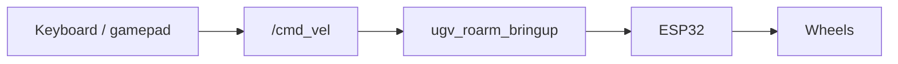

# UGV Teleoperation

Manual driving of the **mobile base** via **`/cmd_vel`**. Implemented in **`ugv_tools`** from [ugv_ws](https://github.com/waveshareteam/ugv_ws) — gamepad in **T1** (`teleop_twist_joy.launch.py`), or keyboard in **T1** (`keyboard_ctrl`). See [Launch teleop](#launch-teleop) for terminal order.

Full UGV-only reference (SLAM while driving, Web Teleop): [ugv_ws teleoperation](https://github.com/waveshareteam/ugv_ws/blob/ros2-humble-develop-251125/docs/teleoperation.md).

!!! note "No pan-tilt gimbal on this kit"
    **UGV Rover + RoArm-M2** uses a **fixed USB camera** (on the arm mount) — there is **no** chassis pan-tilt gimbal. Keyboard `0/1/2/r` and gamepad right-stick pan-tilt from **`ugv_tools`** apply to **PT** UGV kits only; on this robot they have **no effect**. Point the camera by moving the **arm** ([MoveIt2](moveit2.md) / [MoveIt Servo](moveit_servo.md)) or re-aim the base.

For the combined serial driver, see [Hardware Driver](bringup.md).

**Why use this page:** **`ugv_tools`** teleop can **change chassis speed** (gear / scale / launch limits). [MoveIt Servo](moveit_servo.md) can also publish **`/cmd_vel`**, but only at **fixed** scales — see [UGV teleop vs MoveIt Servo](#ugv-teleop-vs-moveit-servo).

---

## Prerequisites

1. **Build and source** **`ugv_roarm_ws`** plus sibling **`ugv_ws`** ([Installation](installation.md)); **`ugv_tools`** must be available.
2. Env: **`ugv_rover`**, **`roarm_m2`**, **`angular_direct`**, **`LDLIDAR_MODEL`** — see [environment variables](index.md#product-names-vs-environment-variables).
3. Stop other **`/cmd_vel`** sources — see [One motion source at a time](#one-motion-source-at-a-time).

!!! warning "Safety"
    With **`ugv_roarm_bringup`** running, the chassis **moves as soon as you press drive keys or move the sticks**. Clear the area around the robot and keep hands away from wheels **before** starting teleop.

---

## Overview

### Before you start

| Do | Do not |
|----|--------|
| [**Start bringup**](bringup.md#launch-bringup_lidarlaunchpy) in **T0** | Run **`ugv_vision`** with default **`use_bringup:=true`** while **`ugv_roarm_bringup`** is up |
| Use **keyboard or gamepad in T1**, not both | Two teleop inputs at once |
| Stop other **`/cmd_vel`** sources first (**`Ctrl+C`**) | LiDAR / vision demos, Nav2, Web Teleop, or MoveIt Servo D-Pad alongside this teleop |

SLAM and Nav2 are documented in [ugv_ws](https://github.com/waveshareteam/ugv_ws) — their launches embed **`ugv_bringup`**, not **`ugv_roarm_bringup`**. On the combined robot, use manual teleop here; for autonomous base motion see [ugv_ws mapping / navigation](https://github.com/waveshareteam/ugv_ws/blob/ros2-humble-develop-251125/docs/navigation.md).

### One motion source at a time {#one-motion-source-at-a-time}

All of these publish **`/cmd_vel`** (or **`behavior_ctrl`** → **`/cmd_vel`**) — use **one at a time**. Press **`Ctrl+C`** in running terminals before starting another.

| | **Keyboard / gamepad** (this page) | **MoveIt Servo** | **LiDAR demos** | **Nav2** | **Vision tracking** | **Web Teleop** |
|---|-----|-----|-----|-----|-----|-----|
| **Launch** | `ugv_roarm_bringup` + `keyboard_ctrl` or `teleop_twist_joy` | `bringup_lidar use_moveit_servo:=true` + `keyboardcontrol` | `ugv_slam` `demo.launch.py` | `ugv_nav` `nav.launch.py` | `ugv_vision` `demo.launch.py` **`use_bringup:=false`** | [ugv_ws Web App](https://github.com/waveshareteam/ugv_ws/blob/ros2-humble-develop-251125/docs/web_app.md) |
| **Purpose** | Manual driving (adjustable speed) | Arm jog; optional **fixed-speed** chassis | Laser follow / guard / avoid | Autonomous navigation | Camera follow / gesture | Browser teleop widget |
| **Input** | Keys or gamepad sticks | D-Pad / arrow keys (chassis) | `/scan` | RViz **2D Goal Pose** | Camera | Browser joystick |

**Data path (hardware):** keyboard / gamepad → **`/cmd_vel`** → **`ugv_roarm_bringup`** → ESP32 → wheels.  
LED: **`ugv/led_ctrl`**.

Vision on the combined robot needs **T0** **`ugv_roarm_bringup`** and **T1** **`ugv_vision`** with **`use_bringup:=false`** — see [Vision](vision.md).

### UGV teleop vs MoveIt Servo {#ugv-teleop-vs-moveit-servo}

| | **UGV Teleoperation** (this page) | **MoveIt Servo** ([MoveIt Servo](moveit_servo.md)) |
|--|-----------------------------------|------------------------------------------------------|
| **Purpose** | Chassis-only drive | Arm jog; optional chassis as a side channel |
| **Launch** | `bringup_lidar` **+** `keyboard_ctrl` / `teleop_twist_joy` | `bringup_lidar use_moveit_servo:=true` (+ `keyboardcontrol` for keys) |
| **Chassis input** | Left stick / drive keys (`i`, `j`, …) | Gamepad **D-Pad** / keyboard **arrows** |
| **Speed control** | **Yes** — gears, `q/z`/`w/x`/`e/c`, launch `*_speed_limit` | **No** — fixed scales (`linear.x` **0.2**, `angular.z` **0.5**) |
| **Arm** | No | Yes (sticks / keys) |

For **chassis + arm on one pad**, use MoveIt Servo — do **not** also run `teleop_twist_joy` or `keyboard_ctrl`.

---

## Launch teleop

| Role | What to run |
|----------|-------------|
| **T0** | [`bringup_lidar.launch.py`](bringup.md#launch-bringup_lidarlaunchpy) |
| **T1** | **Gamepad:** `ros2 launch ugv_tools teleop_twist_joy.launch.py` — see [Gamepad control](#gamepad-control) |
| **T1** | **Keyboard:** `ros2 run ugv_tools keyboard_ctrl` — see [Keyboard control](#keyboard-control) |

Use **gamepad or keyboard in T1**, not both at once.

**T0** (`install/setup.bash` sourced for **ugv_ws** + **ugv_roarm_ws**). **Clear the area** before driving.

```bash
ros2 launch ugv_roarm_bringup bringup_lidar.launch.py use_rviz:=true rviz_config:=bringup
```

!!! note "RViz empty at startup?"
    On **real hardware**, **`rviz_config:=bringup`** uses Fixed Frame **`odom`**, which may not exist yet. Set **Global Options → Fixed Frame** to **`base_footprint`** or **`base_link`**. See [Hardware Driver — RViz Fixed Frame](bringup.md#rviz-bringup-fixed-frame).

Press **`Ctrl+C`** in each terminal when done.

### Launch nodes

| Node | Role |
|------|------|
| `joy_node` | USB gamepad → **`/joy`** (gamepad launch only) |
| `joy_ctrl` | **`/joy`** → **`/cmd_vel`**, **`ugv/led_ctrl`** (gamepad launch only) |
| `keyboard_ctrl` | Keys → **`/cmd_vel`** (keyboard only) |

**Data transfer process**



Keyboard and gamepad do **not** talk to serial directly — **`ugv_roarm_bringup`** forwards velocity to the motor board.

---

## Gamepad control

Use an **Xbox 360–compatible** controller (USB) or a **SHANWAN Android Gamepad** (same as [ugv_ws teleoperation](https://github.com/waveshareteam/ugv_ws/blob/ros2-humble-develop-251125/docs/teleoperation.md)).

**T1** (`install/setup.bash` sourced):

```bash
ros2 launch ugv_tools teleop_twist_joy.launch.py
```

Optional speed caps:

```bash
ros2 launch ugv_tools teleop_twist_joy.launch.py \
  xspeed_limit:=0.5 \
  yspeed_limit:=0.5 \
  angular_speed_limit:=1.0
```

Connect the controller **before** or **after** launch. On the **first** joystick message, release the sticks so they center, then start driving.

**Click an image for full-screen view** — click outside, press **Esc**, or **×** to close.


### Speed level

| Control | Action |
|---------|--------|
| **L2** | Increase speed level |
| **L1** | Decrease speed level |

Speed levels: **`[0.25, 0.5, 0.75, 1.0]`** — scales both linear and angular limits. Terminal prints `[Gear] Linear: …, Angular: …` when the level changes.

Launch defaults: **`xspeed_limit:=0.5`**, **`angular_speed_limit:=1.0`**. Typical max linear at 100% gear on **ugv_rover** ~**1.3 m/s** — lower `xspeed_limit` to cap speed.

### Drive

| Control | Action |
|---------|--------|
| Left stick Y | Linear X (forward / back) |
| Left stick X | Angular Z (rotate) |

Right stick pan-tilt controls from **`ugv_tools`** do **not** apply — this kit has no gimbal (see note above).

### LED

| Control | Action |
|---------|--------|
| **R2** | LED brightness up |
| **R1** | LED brightness down |

LED values publish on **`ugv/led_ctrl`** — forwarded by **`ugv_roarm_bringup`**.

### Supported controllers

| Name reported at startup | Mapping |
|--------------------------|---------|
| `Xbox 360 Controller` | Xbox layout (default) |
| `SHANWAN Android Gamepad` | ShanWan layout |

Other pads use the **Xbox 360** button map. If axes feel wrong, check the name printed when `joy_ctrl` starts.

---

## Keyboard control

**If gamepad teleop is running, stop `teleop_twist_joy.launch.py` first to avoid control conflicts.**

**T1** (`install/setup.bash` sourced):

```bash
ros2 run ugv_tools keyboard_ctrl
```

Keep that terminal **focused** for key input.

**Click an image for full-screen view** — click outside, press **Esc**, or **×** to close.


### Drive layout

| Key | Action |
|-----|--------|
| `i` / `,` | Forward / backward |
| `j` / `l` | Rotate left / right |
| `u` / `o` / `m` / `.` | Forward + turn combinations |
| `k` / **Space** | **Stop** — zero velocity |
| `s` / `S` | Toggle keyboard drive off (publishes zero while off) |

Drive keys **latch** until **Space** / **`k`** (or another drive key). No auto-stop on key release.

### Speed tuning

| Key | Action |
|-----|--------|
| `q` / `z` | ±10% max linear **and** angular speed |
| `w` / `x` | ±10% linear speed only |
| `e` / `c` | ±10% angular speed only |
| `t` / `T` | Toggle linear X vs linear Y mapping |

Default scale at start: linear **0.2**, angular **0.5** (before `q/z` adjustments). Limits: parameters **`linear_speed_limit`**, **`angular_speed_limit`** (default `1.0`).

Pan-tilt keys (`0` / `1` / `2` / `r`) from **`ugv_tools`** do **not** apply on this kit — no chassis gimbal.

---

## Emergency stop

```bash
ros2 topic pub /cmd_vel geometry_msgs/msg/Twist --once
```

---

## Troubleshooting

| Problem | What to try |
|---------|-------------|
| Robot does not move | Confirm **`ugv_roarm_bringup`** on **T0**; see [Hardware Driver](bringup.md) |
| Keyboard has no effect | Click the terminal running **`keyboard_ctrl`**; confirm bringup is running; SSH / docker with a TTY |
| No gamepad / `no joystick found` | Plug in USB controller; check `ros2 topic echo /joy` |
| Sticks drift | Release sticks at connect; restart `teleop_twist_joy.launch.py` |
| Keyboard **and** gamepad both active | Stop one — both publish **`/cmd_vel`** |
| Robot moves without teleop input | Stop vision / LiDAR demos / Nav2 / Servo D-Pad — see [One motion source](#one-motion-source-at-a-time) |
| Serial port busy | Do not run **`ugv_vision`** with default **`use_bringup:=true`** while **`ugv_roarm_bringup`** is up |
| `KeyError: 'UGV_MODEL'` | `source ~/.bashrc`; expected `ugv_rover`, `roarm_m2`, `angular_direct` |

---

## Next

- [MoveIt Servo](moveit_servo.md) — arm jog; optional fixed-speed chassis on one pad
- [MoveIt2](moveit2.md) — arm planning while base is stationary
- [Vision](vision.md) — camera demos (**`use_bringup:=false`** on combined robot)
- [Gazebo](gazebo.md) — same teleop commands in simulation
- [ugv_ws teleoperation](https://github.com/waveshareteam/ugv_ws/blob/ros2-humble-develop-251125/docs/teleoperation.md) — Web Teleop, SLAM while driving, full UGV-only notes

When switching tutorials, stop teleop with **`Ctrl+C`**. Usually **keep `ugv_roarm_bringup` running** unless the next chapter starts its own full stack (e.g. MoveIt with **`use_moveit_servo:=true`**, vision with a new **T1**).
