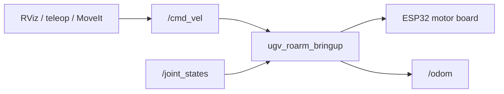

# UGV Basics

UGV-specific concepts for the **UGV Rover** base used in **`ugv_roarm_ws`**. General UGV material also applies to [ugv_ws](https://github.com/waveshareteam/ugv_ws) (RaspRover, UGV Beast, etc.).

!!! note "Scope"
    This repo uses **`UGV_MODEL=ugv_rover`** (UGV Rover 6-wheel 4WD) only. Other bases are documented in [ugv_ws](https://github.com/waveshareteam/ugv_ws).

For URDF and sensor details, see [Robot Description](description.md).

Already built or SSH'd into the factory container? Skip to [Hardware Driver](bringup.md).

---

## Dual-controller layout

WaveShare UGV robots use a **host + slave** architecture:

| Layer | Hardware | Role |
|-------|----------|------|
| **Host** | Raspberry Pi 4B/5 or Jetson Orin Nano | ROS2, MoveIt, teleop |
| **Slave** | ESP32 on motor board | Motor PID, encoders, IMU, OLED, LEDs (optional gimbal servo on **PT** UGV kits — **not** on RoArm combo) |

ROS2 nodes on the host talk to the ESP32 over **UART** (`/dev/ttyAMA0` by default).

**Data transfer process**



---

## Kit types (shop naming)

| Shop name | Sensors / software |
|-----------|-------------------|
| **AI Kit** | USB camera, pan-tilt |
| **ROS2 Kit** | AI Kit + 360° LiDAR + OAK-D Lite (+ SLAM / Nav2 in [ugv_ws](https://github.com/waveshareteam/ugv_ws)) |

**`ugv_roarm_ws`** documents **UGV Rover + RoArm-M2** bringup, MoveIt, and teleop. This combo uses a **fixed USB camera** on the arm/chassis — **no pan-tilt gimbal**. For UGV-only SLAM, Nav2, and vision tutorials see [ugv_ws](https://github.com/waveshareteam/ugv_ws).

Model suffixes on the shop (UGV-only kits; **RoArm combo is not PT**):

| Suffix | Meaning |
|--------|---------|
| **PT** | Pan-tilt gimbal included |
| **PI5 / PI4B** | Raspberry Pi host variant (SSH user `ws`) |
| **Jetson Orin** | NVIDIA Jetson host variant (SSH user `jetson`) |
| **Acce** | Accessories only — you supply the Pi board |
| **ROS2 Kit** | Full sensor kit (LiDAR, depth camera) — autonomous stack in ugv_ws |

---

## `UGV_MODEL` vs product

This repo fixes **`UGV_MODEL=ugv_rover`**:

| `UGV_MODEL` | Chassis | Max speed (typical) | Example product |
|-------------|---------|---------------------|-----------------|
| **`ugv_rover`** | 6-wheel 4WD | ~1.3 m/s | [UGV Rover PT ROS2 Kit](https://www.waveshare.com/ugv-rover-pt-jetson-orin-ros2-kit.htm) |

Other chassis variants (`ugv_beast`, `rasp_rover`, …) are covered in [ugv_ws](https://github.com/waveshareteam/ugv_ws) only.

`LDLIDAR_MODEL` (`ld06`, `ld19`, `stl27l`) is set by `build_first.sh` to match your kit URDF — not required for the tutorials in this doc set.

---

## TF frames

```text
odom → base_footprint → base_link → ugv_roarm_base_link → … → hand_tcp
```

| Frame | Role |
|-------|------|
| `odom` | Wheel odometry frame |
| `base_footprint` | Ground projection of robot center |
| `base_link` | Robot body |
| `ugv_roarm_base_link` | RoArm mount on chassis |

During **real-hardware** bringup, RViz preset **`bringup`** sets **Fixed Frame** to **`odom`**. If RViz is empty at startup, switch to **`base_footprint`** or **`base_link`** — see [Hardware Driver — RViz Fixed Frame](bringup.md#rviz-bringup-fixed-frame). (**Simulation** publishes **`odom`** — no workaround.) Full TF tree: [UGV + RoArm Basics](ugv_roarm_basics.md).

```bash
ros2 run tf2_ros tf2_echo odom base_link
```

---

## Factory Docker image

Most kits ship a **pre-built Docker container** with `UGV_MODEL`, `LDLIDAR_MODEL`, and ROS2 already configured.

### Host login (port 22)

SSH to the **robot host** first — user depends on the board:

| Host board | Host name | SSH user | Password | Port |
|------------|-----------|----------|----------|------|
| Raspberry Pi 4B / 5 | *(IP or mDNS)* | `ws` | `ws` | **22** |
| Jetson Orin Nano | **`jetson`** | `jetson` | `jetson` | **22** |

### Container login (port 23)

After `ros2.sh` starts the container, SSH again into the ROS2 environment:

| Field | Value |
|-------|-------|
| User | `root` |
| Password | `ws` |
| Port | **23** |

### Workflow

**Physical robot (Pi / Jetson)** — SSH into the container after starting Docker on the host:

| Step | Action |
|------|--------|
| 1 | SSH to host — Pi: `ws@<robot-ip>` · Jetson: `jetson@<robot-ip>` |
| 2 | From your PC, SSH to host: `cd /home/ws/ugv_roarm_ws && bash ros2.sh` *(if present)* |
| 3 | From your PC, SSH to container: `root@<robot-ip>` port **23**, password `ws` |
| 4 | Inside container: `cd /home/ws/ugv_roarm_ws && source ~/.bashrc` |

**VM (VirtualBox)** — no SSH; use two local terminals — see [Installation — VM](installation.md#vm-virtualbox-x86).

Container name depends on platform — see [Installation — `ros2.sh` by platform](installation.md#ros2sh-by-platform).

Developers who clone the repo and run `build_first.sh` get the same software without Docker — see [Installation](installation.md).

---

## Related Tutorials

| Chapter | What it adds |
|---------|----------------|
| [Installation](installation.md) | Factory image or source build |
| [Robot Description](description.md) | Combined URDF |
| [Hardware Driver](bringup.md) | `bringup_lidar.launch.py`, serial ports |
| [UGV Teleoperation](teleoperation.md) | Drive the chassis (adjustable speed) |
| [MoveIt Servo](moveit_servo.md) | Arm jog; optional fixed-speed chassis |
| [ROS2 Basics](ros2_basics.md) | Topics and launch files |

**Next:** [Installation](installation.md) — factory image or `build_first.sh`.
